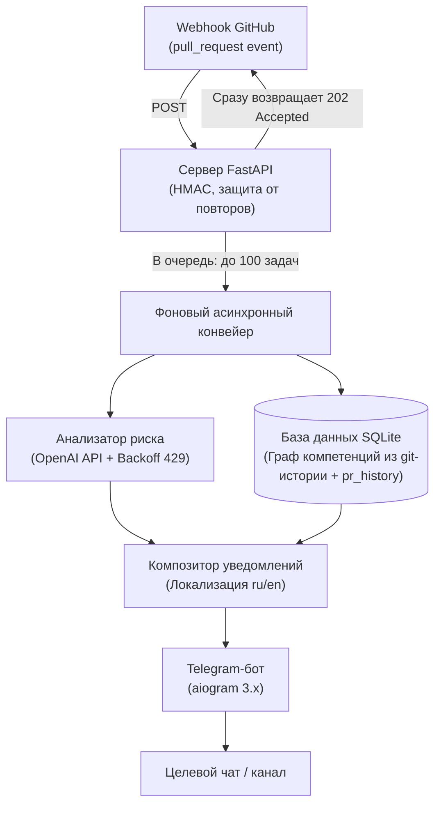

# PR Sentinel

[English](README.md) | **Русский**


Telegram-бот (aiogram 3.x) и FastAPI-webhook, автоматизирующие первичный отбор PR
для GitHub-репозитория. При каждом событии `pull_request` бот генерирует краткую  
3-строчную оценку риска (LOW / MED / HIGH / CRITICAL) через OpenAI API за ~60  
секунд, а затем рекомендует 1–2 релевантных ревьюеров на основе графа компетенций из git-истории, хранящегося в SQLite.

## Технологический стек

Python 3.11+, aiogram 3.x, FastAPI, httpx, OpenAI API, SQLite.

## Архитектура

Как конвейер обрабатывает событие GitHub до отправки уведомления в Telegram-чат:



## Возможности

- **Оценка риска** — LLM-оценка риска PR в 3 строках (LOW / MED / HIGH / CRITICAL) с конкретными причинами и уровнем уверенности, генерируется за ~60 с
- **Обработка ограничений частоты запросов** — повторные запросы при OpenAI 429 с экспоненциальной задержкой (базовая задержка 2 с, максимальная 30 с, 3 попытки)
- **Рекомендация ревьюеров** — граф компетенций из git-истории (SQLite) ранжирует коммитеров по частоте и свежести изменений; рекомендует 1–2 ревьюеров на PR
- **Безопасность webhook** — HMAC-проверка `X-Hub-Signature-256`, защита от повторных запросов по `X-GitHub-Delivery`, лимит тела запроса 5 МБ
- **Асинхронный конвейер** — фоновая очередь обработки (100 элементов); webhook сразу возвращает подтверждение, а анализ выполняется асинхронно
- **Локализация** — уведомления в Telegram на русском (по умолчанию) или английском (`NOTIFICATION_LANGUAGE=en`)
- **CI/CD** — ruff (валидация кода + форматирование), mypy (строгий режим), pytest (порог покрытия тестами 60%), commitlint (Conventional Commits)

## Быстрый старт

```bash
pip install -e ".[dev]"
cp .env.example .env
```

```bash
python -m pr_sentinel.cli index-repo
```

Индексируйте git-историю в граф компетенций (SQLite), который используется для рекомендаций ревьюеров. Граф полностью перестраивается из git-истории при каждом запуске — повторите после существенных изменений истории. Флаги `--repo-path` и `--db-path` переопределяют `REPO_PATH` / `DATABASE_PATH`.

| Переменная | Обязательна | Описание |
|---|---|---|
| `TELEGRAM_BOT_TOKEN` | да | Токен Telegram Bot API |
| `GITHUB_TOKEN` | да | GitHub PAT или fine-grained токен. Использование только на чтение: бот получает diff'ы PR и списки файлов, в GitHub он ничего не пишет. Классический PAT: скоуп `repo` (обязателен для приватных репозиториев). Fine-grained: `Contents: Read` + `Pull requests: Read` для целевого репозитория. |
| `GITHUB_WEBHOOK_SECRET` | да | HMAC-секрет для `X-Hub-Signature-256` (настраивается в конфигурации webhook GitHub) |
| `OPENAI_API_KEY` | да | Ключ OpenAI API (или `none` для локального vLLM) |
| `OPENAI_BASE_URL` | нет | По умолчанию `https://api.openai.com/v1` |
| `OPENAI_MODEL` | нет | По умолчанию `gpt-4o` |
| `GITHUB_REPO` | да | `owner/repo` для мониторинга |
| `TELEGRAM_CHAT_ID` | да | ID целевого чата/канала |
| `DATABASE_PATH` | нет | По умолчанию `pr_sentinel.db` |
| `NOTIFICATION_LANGUAGE` | нет | `ru` (по умолчанию) или `en` |
| `REPO_PATH` | нет | Локальный чекаут `GITHUB_REPO`, из которого строится граф компетенций (бот и standalone webhook). По умолчанию `.` |
| `LATENCY_BUDGET_SECONDS` | нет | Бюджет задержки уведомления (приём вебхука → отправка в Telegram); превышение логируется WARNING. По умолчанию `10` |
| `GRAPH_REFRESH_INTERVAL_SECONDS` | нет | Интервал периодической пересборки графа компетенций; `0` отключает. По умолчанию `3600` |

Полный справочник: [`docs/architecture.md`](docs/architecture.md) § Configuration.

## Запуск приложения

После настройки переменных окружения (см. таблицу выше) запустите сервисы:

**Бот + webhook в одном процессе:**

```bash
python -m pr_sentinel.main
```

**Только сервер webhook:**

```bash
uvicorn pr_sentinel.webhook.server:app
```

**Запуск тестов:**

```bash
pytest
```

**Запуск тестов с проверкой покрытия (минимум 60%):**

```bash
pytest --cov=pr_sentinel --cov-fail-under=60
```

Полное описание процесса разработки (линтинг, форматирование, проверка типов, создание коммитов и PR) см. в [`CONTRIBUTING.md`](CONTRIBUTING.md).

### Локальное тестирование webhook

GitHub доставляет webhooks только на публичный HTTPS-адрес. Для локальной разработки прокиньте сервер через туннель:

```bash
ngrok http 8000
```

(или localtunnel), затем укажите `<tunnel-url>/webhook/github` в качестве webhook-адреса в настройках репозитория GitHub (Settings → Webhooks → Add webhook; тип содержимого `application/json`; события: `pull_request`; секрет — ваш `GITHUB_WEBHOOK_SECRET`). Для продакшена разверните сервер на хосте с публичным доменом + SSL и укажите этот же webhook-адрес туда, синхронизировав секрет.

## Развёртывание (Docker)

```bash
cp .env.example .env   # затем правьте секреты, chmod 600 .env
docker compose up -d
```

Контейнер запускает бота и webhook-сервер вместе, хранит SQLite-базу в `./data`
и проверяет здоровье через `GET /health`. Полное руководство по продакшену —
TLS reverse proxy, настройка GitHub webhook, бэкапы, обновление графа,
обновление и откат: [`docs/deployment.md`](docs/deployment.md).

## Пример уведомления

Что бот публикует в чат для каждого нового PR (язык шаблона по умолчанию
русский; параметр `NOTIFICATION_LANGUAGE=en` переключает его на английский):

```text
🔀 PR: Add retry on 429 rate-limit
📊 Риск: 🟡 Средний
💡 Изменения затрагивают аутентификацию • Добавлен код без тестов
👥 Ревьюеры: @alice, @bob
🔗 https://github.com/owner/repo/pull/42
```

## Документация

- [`CONTRIBUTING.md`](CONTRIBUTING.md) — настройка, стиль кода, тестирование, коммиты, PR и защита веток
- [`COMMIT_CONVENTIONS.md`](COMMIT_CONVENTIONS.md) — справочник по соглашению о коммитах (Conventional Commits)
- [`SECURITY.md`](SECURITY.md) — политика безопасности, сообщения об уязвимостях, поддерживаемые версии
- [`docs/architecture.md`](docs/architecture.md) — архитектура, HTTP API, модель данных, конфигурация

## Лицензия

Этот проект распространяется под лицензией MIT. Подробности см. в файле [LICENSE](LICENSE).

> **🤖 AI-assisted development (vibe-coded).** Концепция проекта была создана  
> командой разработки; реализация выполнена с помощью ИИ (LLM-агенты для  
> написания кода). Финальное состояние было проверено и утверждено людьми.
